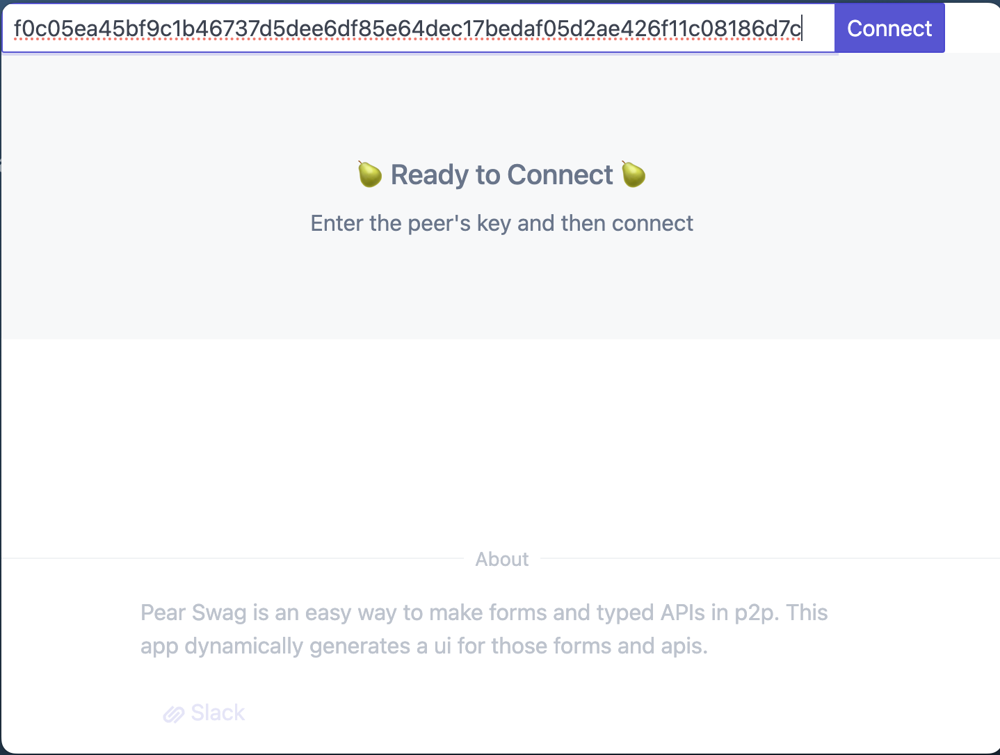
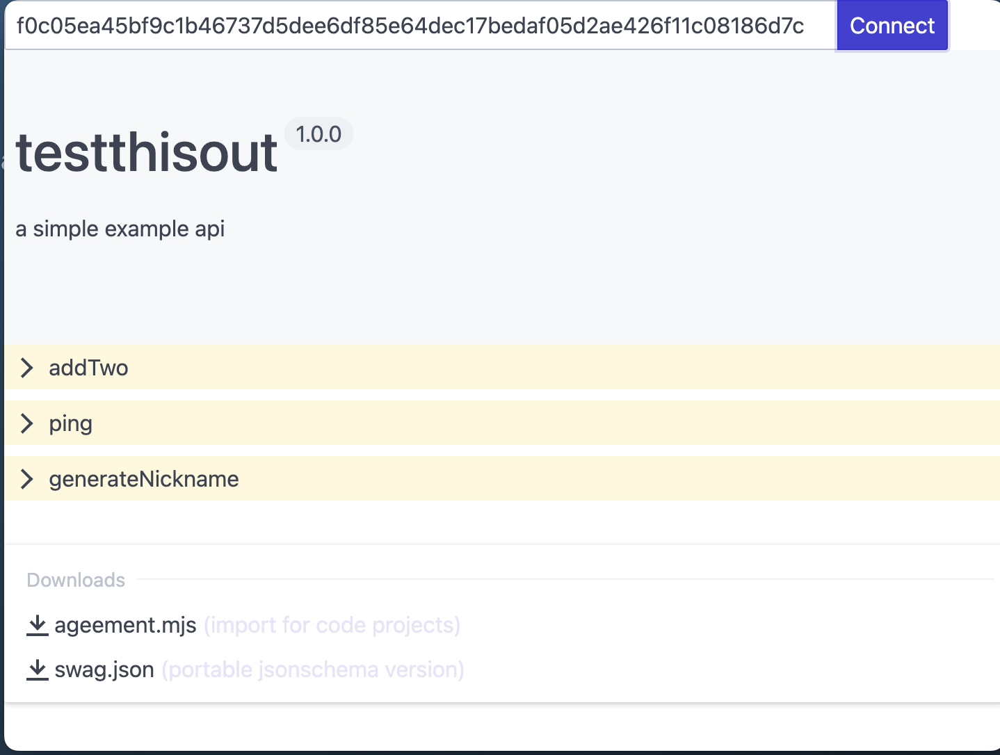
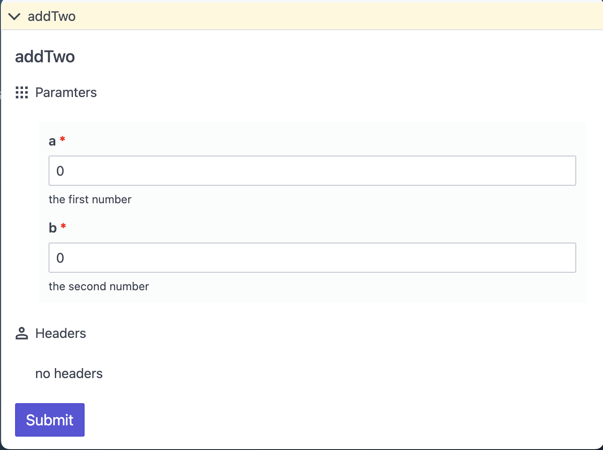
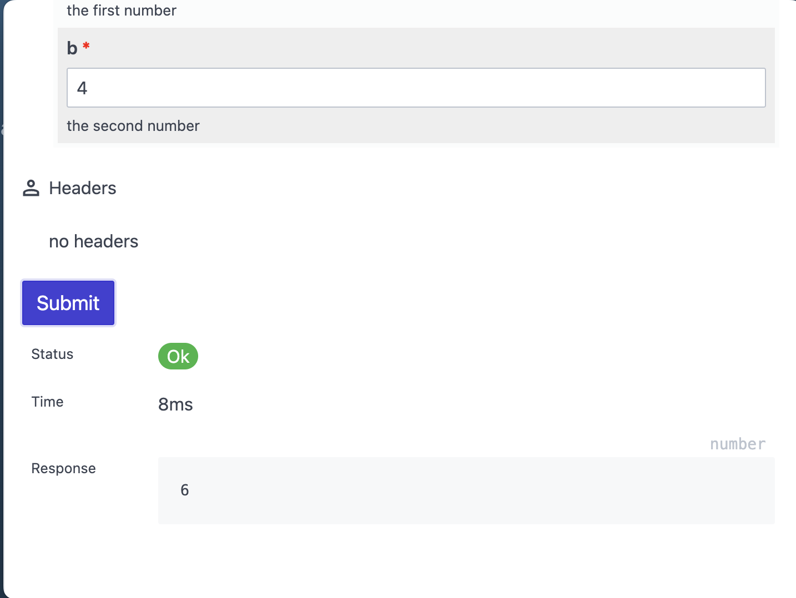

Agreeable UI
------------

A RPC explorer like swagger for [agreeable](https://github.com/ryanramage/agreeable) p2p services. 

See [agreeable-peer](https://github.com/ryanramage/agreeable-peer) for creating p2p services that you can test with this tool.

This tool can also be run with pear, over p2p with 

```
pear run pear://qrxbzxyqup1egwjnrmp7fcikk31nekecn43xerq65iq3gjxiaury
```

But if you want to inspect the code, and run it locally. clone this repo and run 

```
pear dev .
```

The first screen will ask you for a peer key to connect to.



On connection



Once it connects, you will see the api role, version and description. Then the routes available to call as functions. You can also download the agreement in .mjs or .json




You can expand a route to inspect it and see the parameters, types and prepare to call it




on submit you will see the result that was provided from the remote server


